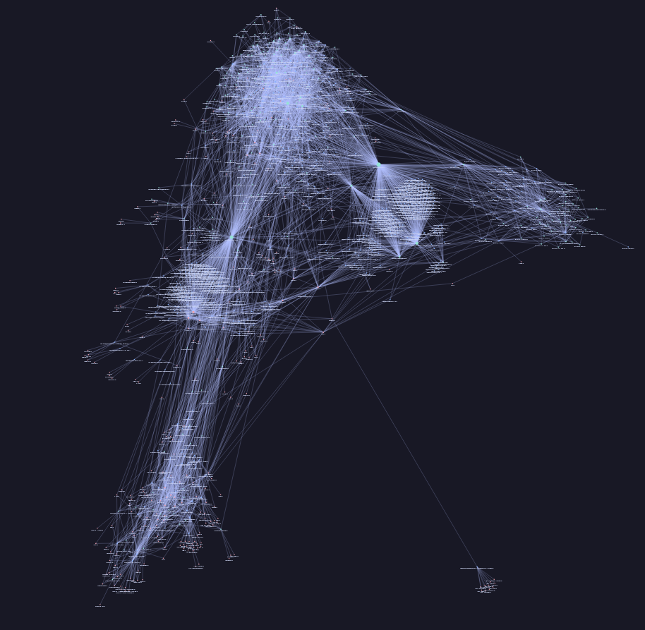

# SeaDog

One file client-side web app to visualize C file dependencies using an interactive force directed graph. This tool helps developers understand and analyze the relationships between C/C++ source files in a project.

## Features
- **Interactive Visualization**: Displays C file dependencies as a force-directed graph.
- **Client-Side Only**: No server required; everything runs in the browser.
- **Simple and Lightweight**: Single-file implementation for easy usage and distribution.

## Usage
1. Clone this repository or download `seadog.html`.
2. Open `seadog.html`
3. Click `Browse`
4. Choose a C/C++ folder you would like to visualize
5. If `Are you sure you want to upload all files from ...` shows up, click on `Upload`
6. Voilà!

## Acknowledgments
- Inspired by [Obsidian's Graph view](https://help.obsidian.md/plugins/graph).
- Special thanks to the [D3.js open-source JavaScript library](https://d3js.org/) for graph visualization.

## Example visuzalization
[Curl main branch](https://github.com/curl/curl)

